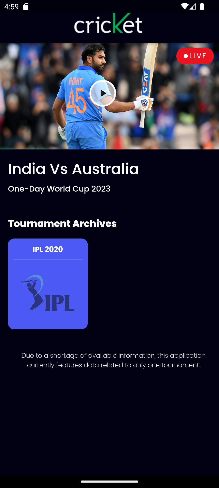
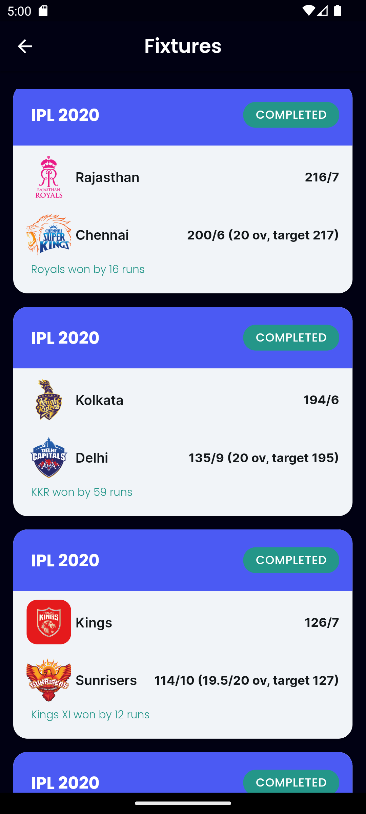
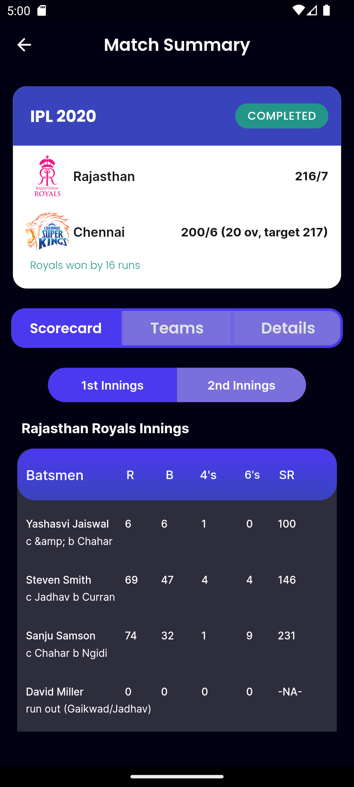

# Cricket Match Info App - IPL 2020

```markdown

Welcome to the **Cricket Match Info App**! This Flutter application provides detailed information about the IPL 2020 tournament, showcasing match data in a user-friendly interface. Designed to enhance understanding of API integration, this app fetches and displays cricket match information efficiently. 📊✨

## Table of Contents 📚

- [Features](#features)
- [Technologies Used](#technologies-used)
- [Installation](#installation)
- [Usage](#usage)
- [Commands](#commands)
- [Contributing](#contributing)
- [License](#license)

## Features 🌟

- **Match Information**: View details of IPL 2020 matches, including scores and player statistics. 📈
- **User-Friendly Interface**: Simple navigation across four pages for easy access to match data. 📱
- **Data Fetching**: Utilizes APIs to retrieve live cricket data. 🔄
## Home Page


## Main Page


## Fixtures


## Match Details

.png)
.png)
.png)

## Technologies Used 🛠️

- **Flutter**: For building the cross-platform mobile application. 🌐
- **Supabase**: For storing and managing cricket data. 🗄️
- **Python**: For fetching data from the API and processing it. 🐍
- **RapidAPI**: Cricket data provided by [Sport Content API](https://rapidapi.com/sportcontentapi/api/cricket-live-data/playground/apiendpoint_6dd4d8c1-3369-4a89-9805-7e93a069208f). 📊

## Installation ⚙️

To get started with the Cricket Match Info App, follow these steps:

### Prerequisites ✅

Ensure you have the following installed on your machine:

- Flutter SDK
- Dart SDK
- Python 3.x

### Clone the Repository 📥

1. Open your terminal or command prompt.
2. Clone the repository using the following command:

   ```bash
   git clone https://github.com/your-username/cricket-match-info-app.git
   ```

3. Navigate into the project directory:

   ```bash
   cd cricket-match-info-app
   ```

### Install Dependencies 📦

Run the following command to install the required Flutter packages:

```bash
flutter pub get
```

## Usage 🚀

1. Launch the app on your device or emulator. 📲
2. Navigate through the four pages to explore match information, player stats, and more. 🏆

## Commands 📝

- To run the app:

  ```bash
  flutter run
  ```

- To build the app for release:

  ```bash
  flutter build apk
  ```

## Contributing 🤝

Contributions are welcome! If you have suggestions or improvements, please fork the repository and submit a pull request. 💡


